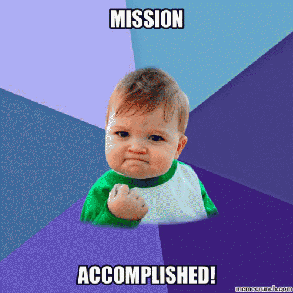

# BOOK STORE MERN PROJECT

This is a project idea picked up from freeCodeCamp where I learnt how to use the MERN stack to build a full stack web application.

This was also a refresher as I got to build out APIs for the application using Node.js and Express for creating the routes.

I typically worked with Python and Flask to develop API routes but working with Node and Express actually showed me new patterns of thought to work with new technologies. This was really amazing.

Big thanks to frreCodeCamp!!!

For the backend, I used vite and React with JS. I learnt how to incorporate a new library to myself called notistack. It is honestly pretty niffty tool when it comes to beautiful display of notification on call of function.

I also got to use axios which honestly I was terrified about but really shouldn't have been too worried about. It was pretty easy to understand by reading documentation (I usually find this intense) and a few video tutorials. I wondered why we used axios instead of Javascript's fetch but I got notice just how short my code was without parsing json responses. 🤯

All in all this was a great experience.

